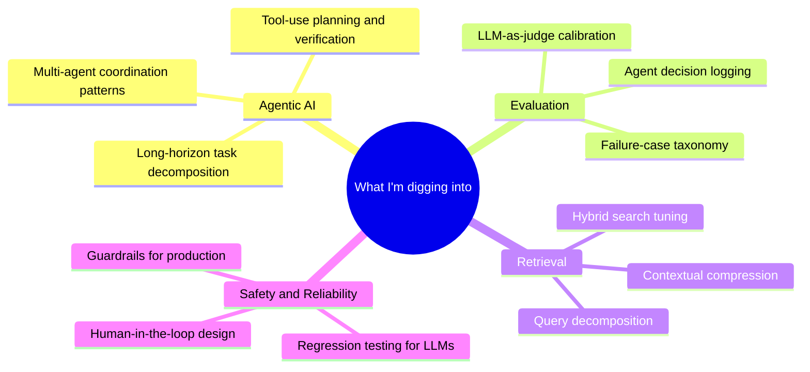

 

---

## About

I design and ship production GenAI systems — the messy, end-to-end kind, not just demos. **MSc Artificial Intelligence (Distinction)** from Queen Mary University of London, **4+ years** of engineering experience, and a track record of taking ambiguous problems through architecture, deployment, and adoption.

Most recently I co-founded **Scintilink** *(Dec 2024 – Sept 2025)*, a multi-agent AI platform that served 100+ researchers in production. Before that, I spent three years at Lumen Technologies shipping AI-driven forecasting tools that informed **$25M+ in annual network investment decisions**.

I care about AI that's safe, reliable, and actually useful — not just impressive in a screenshot.

---

## 🚀 Recent Work

### Scintilink — Multi-Agent Research Platform `Co-founder · Dec 2024 – Sept 2025`

An 8-agent system orchestrated with LangGraph, deployed on GCP, helping researchers reason over scientific literature with citation-backed answers.

| Metric | Result |
|---|---|
| Processing latency | **−40%** via intelligent routing & state management |
| Extraction accuracy | **+30%** through context engineering |
| Documents analysed | **500+** automated runs in production |
| Retrieval architecture | Hybrid BM25 + OpenAI embeddings + Reciprocal Rank Fusion |

---

## 🏆 Featured Projects

### 🧠 Agentic Financial Intelligence System
**Fine-tuned LLM + Multi-Agent RAG + Graph Neural Networks**

- **Fine-tuned Microsoft Phi-4 (14.7B params)** with LoRA on FinQA → **+550% accuracy** on financial QA
- **3-way LangGraph query router** over a **68,989-embedding Qdrant pipeline**
- Streaming ingestion of **18,000+ SEC EDGAR filings** → knowledge graph of **17,552 nodes / 420,796 edges**
- Four GNN architectures: GraphSAGE, GATv2, Temporal GNN, Global Graph RAG

### 🧭 Agentic LLM Router
**Cost/latency-aware model routing with confidence escalation**

A LangGraph pipeline that classifies intent, scores mission-criticality and latency-sensitivity, then picks the optimal model and deployment target — with **0.65 confidence-threshold** escalation, intent-aware fallbacks, and full Pydantic pipeline traces for observability.

### 🚗 Automotive RAG Chatbot
**Hybrid retrieval over BMW, Tesla, and Ford annual reports**

BM25 (30%) + semantic (70%) fused via Reciprocal Rank Fusion across 2,871 chunks → **85.9% keyword match**, **100% pass rate** on 13-case eval suite.

### 📚 Legal Search Engine
Sub-500ms search on 100k+ documents · BM25Okapi · multi-threaded.

---

## 🛠️ Tech Stack

**Core Languages & Frameworks**

**Cloud, Infra & Data**

**Agentic & LLM** — LangGraph · LangChain · LangSmith · HuggingFace Transformers · LoRA · PEFT · OpenAI · Anthropic · Groq · FlashAttention-2

**RAG & Retrieval** — Hybrid retrieval (BM25 + semantic + RRF) · Qdrant · ChromaDB · Pinecone · Multilingual-E5-Large · knowledge graphs

**Evaluation & Observability** — Custom eval harnesses · A/B testing · agent decision logs · telemetry dashboards · regression testing

---

## 📈 Selected Impact

| | |
|---|---|
| 🚀 | Co-founded and shipped a production 8-agent platform serving 100+ researchers |
| ⚡ | Cut multi-agent processing latency by 40% through intelligent routing |
| 🎯 | Achieved 550% accuracy improvement fine-tuning a 14.7B-parameter LLM |
| 💰 | Built forecasting tools supporting $25M+ in annual network investment decisions |
| ⏱️ | Delivered a critical product **7 months ahead of schedule** (2 months vs. 9-month estimate) |
| 🗄️ | Optimised an Oracle PL/SQL system handling 10M+ monthly queries → +60% SQL performance |
| 🎓 | MSc Artificial Intelligence — **Distinction**, Queen Mary University of London |

---

## 📊 GitHub Stats

 

  

---

## 🔭 Currently Exploring

---

## 🎓 Education & Certifications

**MSc Artificial Intelligence** — Queen Mary University of London (2024–2025) · *Distinction*  
**B.Tech Computer Science & Systems Engineering** — KIIT University (2017–2021)

| Provider | Certification |
|:--------|:--------------|
| DeepLearning.AI | Neural Networks & Deep Learning · Improving Deep Neural Networks · Structuring ML Projects |
| Google Cloud | Introduction to Generative AI · Google Cloud Essentials |
| Duke University | Business Metrics for Data-Driven Companies |
| Rice University | Hypothesis Testing & Confidence Intervals |

---

## 📫 Let's Connect

**Open to:** Applied AI / AI engineer roles focused on agentic systems, RAG, and production LLM work. Based in **London, UK** — happy to discuss remote, hybrid, or relocation.

- 💼 **LinkedIn** — [neelay-choudhury-768537152](https://linkedin.com/in/neelay-choudhury-768537152)
- 📧 **neelaychoudhury1999@gmail.com**

