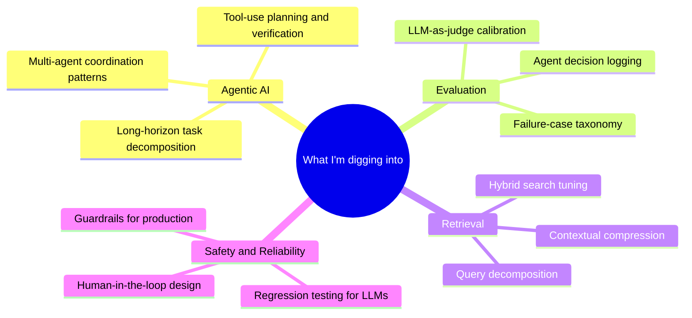

# Neelay Choudhury

### Applied AI Engineer · Building production multi-agent systems

---

## About

I design and ship production GenAI systems — the messy, end-to-end kind, not just demos. **MSc Artificial Intelligence (Distinction)** from Queen Mary University of London, **4+ years** of engineering experience, and a track record of taking ambiguous problems through architecture, deployment, and adoption.

Currently co-founding **[Scintilink](https://scintilink.com)**, a live multi-agent AI platform serving 100+ researchers. Before that, I was an engineer at Lumen Technologies, where I shipped AI-driven forecasting tools that informed **$25M+ in annual network investment decisions**.

I care about AI that's safe, reliable, and actually useful — not just impressive in a screenshot.

---

## 🚀 What I'm Building

### [Scintilink](https://scintilink.com) — Multi-Agent Research Platform `In production · 100+ users`

An 8-agent system orchestrated with LangGraph, deployed on GCP, helping researchers reason over scientific literature with citation-backed answers.

| Metric | Result |
|---|---|
| Processing latency | **−40%** via intelligent routing & state management |
| Extraction accuracy | **+30%** through context engineering |
| Documents analysed | **500+** automated runs in production |
| Retrieval architecture | Hybrid BM25 + OpenAI embeddings + Reciprocal Rank Fusion |
| Stack | LangGraph · LangChain · LangSmith · Qdrant · GCP Cloud Run · Firestore · Docker |

Built custom evaluation harnesses, prompt pattern libraries, telemetry dashboards, and safety guardrails — because shipping agents without observability is shipping liabilities.

---

## 🏆 Featured Projects

### 🧠 Agentic Financial Intelligence System
**Fine-tuned LLM + Multi-Agent RAG + Graph Neural Networks**

- **Fine-tuned Microsoft Phi-4 (14.7B params)** with LoRA on FinQA → **+550% accuracy** on financial QA, with FlashAttention-2 optimisation and production quantisation
- **3-way LangGraph query router** (numerical reasoning · local graph traversal · global community detection) over a **68,989-embedding Qdrant pipeline**
- Streaming ingestion of **18,000+ SEC EDGAR filings** into a heterogeneous knowledge graph of **17,552 nodes** and **420,796 edges**
- Integrated four GNN architectures: GraphSAGE, GATv2, Temporal GNN, Global Graph RAG

`PyTorch` · `LangGraph` · `HuggingFace` · `Qdrant` · `GCP` · `Yahoo Finance API`

---

### 🧭 Agentic LLM Router
**Cost/latency-aware model routing with confidence escalation**

A LangGraph pipeline that classifies intent, scores mission-criticality and latency-sensitivity, then picks the optimal model and deployment target (edge vs. cloud) — with confidence-based escalation at a **0.65 threshold**.

- Four sequential LLM calls feeding a single routing decision
- Intent-aware fallbacks → **zero bare exceptions** across all paths
- Full pipeline traces via Pydantic `PipelineTrace` for observability
- Benchmarked across 15 queries with **honest failure-case analysis** (because cherry-picked benchmarks help nobody)

`LangGraph` · `Pydantic` · `OpenAI` · `Groq`

---

### 🚗 Automotive RAG Chatbot
**Hybrid retrieval over BMW, Tesla, and Ford annual reports**

- Hybrid RAG: **BM25 (30%) + semantic (70%)** fused via Reciprocal Rank Fusion across **2,871 chunks**
- **85.9% keyword match accuracy**, **100% pass rate** on a 13-case evaluation suite
- Designed specifically to handle the failure modes of semantic-only retrieval: financial acronyms, exact figures, temporal comparisons

`ChromaDB` · `OpenAI Embeddings` · `BM25` · `LangChain`

---

### 📚 Legal Search Engine
**High-performance retrieval over 100k+ legal documents**

- **Sub-500ms** search response on 100k+ documents
- BM25Okapi ranking with multi-threaded architecture

`Python` · `NLP` · `Information Retrieval`

---

## 🛠️ Tech Stack

**Agentic Systems** — LangGraph · LangChain · LangSmith · ReAct · Plan-and-Execute · coordinator-agent patterns · context engineering · human-in-the-loop escalation

**LLMs & Fine-tuning** — HuggingFace Transformers · LoRA · PEFT · OpenAI · Anthropic · Groq · FlashAttention-2 · quantisation

**RAG & Retrieval** — Hybrid retrieval (BM25 + semantic + RRF) · Qdrant · ChromaDB · Pinecone · Multilingual-E5-Large · knowledge graphs

**Evaluation & Observability** — Custom eval harnesses · A/B testing · agent decision logs · telemetry dashboards · regression testing

**Core Stack** — Python · FastAPI · PyTorch · TensorFlow · SQL (Oracle, PostgreSQL, MySQL) · C++ · JavaScript

**Cloud & Infra** — GCP (Cloud Run, Firestore, Firebase) · AWS · Docker · CI/CD · Kubernetes (familiar)

**Data at Scale** — Production pipelines processing **500GB+ daily** · distributed processing on **2TB+ datasets** · streaming event processing

---

## 📈 Selected Impact

| | |
|---|---|
| 🚀 | Co-founded and shipped a production 8-agent platform serving 100+ researchers |
| ⚡ | Cut multi-agent processing latency by 40% through intelligent routing |
| 🎯 | Achieved 550% accuracy improvement fine-tuning a 14.7B-parameter LLM |
| 💰 | Built forecasting tools supporting $25M+ in annual network investment decisions (Lumen) |
| ⏱️ | Delivered a critical product **7 months ahead of schedule** (2 months vs. 9-month estimate) |
| 🗄️ | Optimised an Oracle PL/SQL system handling 10M+ monthly queries → +60% SQL performance |
| 🎓 | MSc Artificial Intelligence — **Distinction**, Queen Mary University of London |

---

## 🔭 Currently Exploring

---

## 🎓 Education & Certifications

**MSc Artificial Intelligence** — Queen Mary University of London (2024–2025) · *Distinction*  
**B.Tech Computer Science & Systems Engineering** — KIIT University (2017–2021)

| Provider | Certification |
|:--------|:--------------|
| DeepLearning.AI | Neural Networks & Deep Learning |
| DeepLearning.AI | Improving Deep Neural Networks |
| DeepLearning.AI | Structuring ML Projects |
| Google Cloud | Introduction to Generative AI |
| Google Cloud | Google Cloud Essentials |
| Duke University | Business Metrics for Data-Driven Companies |
| Rice University | Hypothesis Testing & Confidence Intervals |

---

## 📊 GitHub

---

## 📫 Let's Connect

I'm open to collaborating on agentic systems, applied research roles, and conversations about building AI that ships. Based in **London, UK**.

- 🌐 **scintilink.com** — what I'm building right now
- 💼 **LinkedIn** — [neelay-choudhury-768537152](https://linkedin.com/in/neelay-choudhury-768537152)
- 📧 **neelaychoudhury1999@gmail.com**

